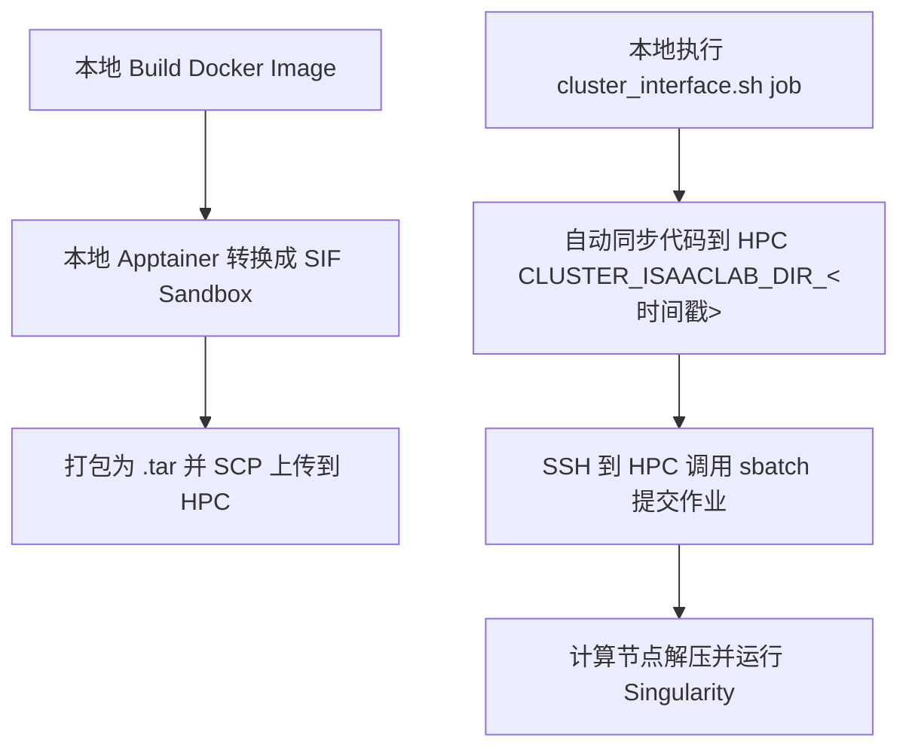

# Isaac Lab HPC (超算集群) 部署与运行指南

本文档总结了如何在 HPC (超算/集群) 环境下部署和使用 Isaac Lab Docker 镜像。

由于 HPC 集群出于安全原因不允许直接运行 `docker run`，且普通用户没有 Root 权限，我们必须在**本地将 Docker 镜像转换为 Apptainer/Singularity 镜像（.sif 文件或 Sandbox 目录）**，然后上传到 HPC 运行。

本文提供了两种方案：
1. **官方标准集群方案 (Official Cluster Interface)**：基于 Isaac Lab 官方 of `cluster_interface.sh` 脚本和工作流。
2. **自定义 Root 沙盒化开发方案 (Custom Root-Sandbox)**：本仓库基于 `Dockerfile.hpc` 优化的沙盒方案，更适合多项目并行开发与依赖动态更新。

---

## 方案对比与选型建议

| 特性 | 方案 1：官方标准集群方案 (`cluster_interface.sh`) | 方案 2：自定义 Root 沙盒方案 (`Dockerfile.hpc`) |
| :--- | :--- | :--- |
| **容器格式** | Singularity Sandbox 打包成 `.tar` (在节点临时解压运行) | Singularity Sandbox 目录 (直接在持久存储解压并执行) |
| **代码热更新** | **自动同步**。每次提交作业时，脚本自动将本地代码同步到超算临时目录。 | **动态挂载**。通过绑定宿主机代码目录，宿主机修改代码，容器内立即生效。 |
| **Python 依赖** | **静态只读**。若要修改或安装新的 pip 包，必须在本地重新 build 并上传。 | **动态可写**。支持 `pip install -e`，依赖会安装到专门挂载的隔离宿主机 Home 中。 |
| **用户权限对齐**| **要求严格**。本地构建镜像的用户 UID/GID 必须与 HPC 完全一致，否则报权限错误。 | **免对齐 (Root 映射)**。以 Root 构建，Apptainer 运行时自动映射，无权限烦恼。 |
| **适用场景** | 适合代码结构相对固定、无需频繁修改第三方依赖的纯训练/测试阶段。 | **适合多项目并行开发**、需要频繁修改或以可编辑模式安装代码的调试开发阶段。 |

---

## 一、 方案 1：官方标准集群方案 (Official Cluster Interface)

官方实现主要依赖本地的 `docker/cluster/` 目录中的脚本。其核心逻辑是：**本地打包 $\rightarrow$ 自动同步代码 $\rightarrow$ 自动提交 SLURM 作业**。



### 1. 配置文件修改
首先，修改本地 `/home/hz/IsaacLab/docker/cluster/.env.cluster` 以对齐您的集群配置：
```bash
# 调度器类型，支持 SLURM 或 PBS
CLUSTER_JOB_SCHEDULER=SLURM

# 缓存目录：用于存放 Omniverse/Isaac Sim 各种运行时缓存，防止冷启动时重复编译着色器
CLUSTER_ISAAC_SIM_CACHE_DIR=/hpc2hdd/home/hwang721/docker-isaac-sim

# 远程 HPC 上的 IsaacLab 存放根目录
CLUSTER_ISAACLAB_DIR=/hpc2hdd/home/hwang721/isaaclab

# 远程 HPC 登录节点 SSH 连结信息
CLUSTER_LOGIN=hwang721@hpc_ip

# SIF 镜像文件在超算上的存放路径
CLUSTER_SIF_PATH=/hpc2hdd/home/hwang721/isaaclab_docker/
```

### 2. 常用操作命令

#### 步骤 1：本地打包并推送镜像
确保本地机器已安装 Apptainer/Singularity (建议版本 >= 1.3.4)，并在本地成功 build 了 Docker 镜像 `isaac-lab-base:latest`：
```bash
cd /home/hz/IsaacLab/docker
# 该脚本会自动将本地 Docker 镜像转为 Singularity Sandbox 并打包上传至 CLUSTER_SIF_PATH
./cluster/cluster_interface.sh push base
```

#### 步骤 2：本地一键同步代码并提交作业
```bash
# 自动同步本地最新修改 of Isaac Lab 代码，并以 base 镜像在超算上提交训练任务
./cluster/cluster_interface.sh job base --args "--headless --task Isaac-Cartpole-v0"
```
> [!NOTE]
> 每次执行 `job` 命令时，官方脚本都会在超算上创建一个带有当前时间戳的临时目录（如 `CLUSTER_ISAACLAB_DIR_20260601_1450`），将本地最新代码 `rsync` 过去。超算节点运行完毕后，该临时代码副本会被自动清理或保留（取决于 `.env.cluster` 中的 `REMOVE_CODE_COPY_AFTER_JOB` 设置）。

---

## 二、 方案 2：自定义 Root 沙盒化开发方案 (Custom Root-Sandbox)

由于官方方案中 SIF 内的 Python 环境是只读的，当需要开发自定义项目并使用 `pip install -e .` 安装 editable 包时，容易报只读文件系统错误。

本仓库在 `/home/hz/isaaclab_docker` 中实现了一套针对此痛点优化的 **Root 模式 Sandbox 方案**。

### 1. 核心改进设计
* **Dockerfile.hpc**：直接以 `root` 用户构建，在 HPC 上运行时由 Apptainer 的 `--fakeroot` 将其映射为 HPC 的普通用户。
* **隔离挂载挂接**：在启动时将超算宿主机的专属隔离 Home 目录挂载到 `/root`，将宿主机代码挂载到 `/workspace/project`。使得 `pip install --user` 等写入操作全部落盘在宿主机中，实现了镜像只读、依赖可写的完美隔离。

### 2. 本地构建与上传

我们提供了一键自动化打包脚本 `pack_sandbox.sh`：
```bash
cd /home/hz/isaaclab_docker

# 1. 自动执行 Docker 编译、Sandbox 转换和 tar 打包
./pack_sandbox.sh

# 2. 将打包好的 tar 镜像上传至超算（建议使用 rsync 支持断点续传）
rsync -avP sim51_lab232_hpc_sandbox.tar hwang721@hpc:/hpc2hdd/home/hwang721/isaaclab_docker/
```

### 3. HPC 部署与运行

#### 3.1 解压沙盒目录 (只需执行一次)
登录 HPC 后，进入容器存放目录并解压：
```bash
cd /hpc2hdd/home/hwang721/isaaclab_docker
tar -xf sim51_lab232_hpc_sandbox.tar
# 解压后将生成 sim51_lab232_hpc_sandbox/ 文件夹，它是可以直接执行的可写 Sandbox 目录
```

#### 3.2 交互式调试命令 (srun)
1. 申请 GPU 计算节点以进行交互式调试：
   ```bash
   srun -p debug -n 4 --mem=8G --gres=gpu:1 --time=00:30:00 --pty bash
   ```
2. 加载 Singularity/Apptainer 模块：
   ```bash
   module load singularity-ce-4.1.3
   ```
3. 在宿主机上创建专门给本项目存放 pip 依赖的隔离目录，以及代码工作区：
   ```bash
    mkdir -p /hpc2hdd/home/hwang721/container_homes/proprioception/tmp
    mkdir -p /hpc2hdd/home/hwang721/ws/proprioception
    ```
4. 启动 Singularity 容器（注意绑定专属的 /tmp 路径，避免超算共享 /tmp 目录下的权限冲突报错）：
   ```bash
   singularity exec --nv --writable \
     --bind /hpc2hdd/home/hwang721/container_homes/proprioception/tmp:/tmp \
     --bind /hpc2hdd/home/hwang721/container_homes/proprioception:/root:rw \
     --bind /hpc2hdd/home/hwang721/ws/proprioception:/workspace/project:rw \
     --env ACCEPT_EULA=Y --env PRIVACY_CONSENT=Y \
     --env NVIDIA_DRIVER_CAPABILITIES=all \
     /hpc2hdd/home/hwang721/isaaclab_docker/sim51_lab232_hpc_sandbox bash -i
   ```
5. 进入容器后，即可安装动态开发的项目包：
   ```bash
   cd /workspace/project
   # 执行可编辑模式安装，生成的元数据与新安装的包都会安全地写入到绑定的 /root/ 物理路径下
   pip install --user -e ./source/proprioception
   ```

#### 3.3 作业后台提交命令 (sbatch)
本仓库提供了自动化提交脚本 `submit_slurm.sh`，它会自动处理 Omniverse 缓存的挂载与回写逻辑：
```bash
# 切换到项目代码根目录下
cd /hpc2hdd/home/hwang721/ws/proprioception

# 提交 SLURM 后台任务
/hpc2hdd/home/hwang721/isaaclab_docker/submit_slurm.sh \
  --sandbox /hpc2hdd/home/hwang721/isaaclab_docker/sim51_lab232_hpc_sandbox \
  --project /hpc2hdd/home/hwang721/ws/proprioception \
  --cache /hpc2hdd/home/hwang721/isaaclab_cache \
  --script scripts/reinforcement_learning/rsl_rl/train.py \
  --args "--headless --task Isaac-Cartpole-v0"
```

---

## 三、 超算运行关键优化与注意事项

### 1. 缓存热启动 (Cache Persistence)
首次启动 Isaac Sim 会触发庞大的 **Shader 编译（Shader Compilation）** 流程，导致首次加载极其缓慢。
* **优化策略**：官方脚本和我们的 `run_sandbox.sh` 脚本均加入了缓存同步逻辑。它会在任务开始前，将持久存储目录中的 `kit/cache`、`ov`、`GLCache`、`ComputeCache` 等拷贝到计算节点的本地高速 `$TMPDIR` 下。任务运行结束后，再将增量缓存 `rsync` 增量回传到持久存储。
* **使用建议**：请确保后台作业参数中配置了有效的 `CACHE_PATH` 路径。

### 2. Headless 运行
由于超算节点没有物理显示器，运行仿真脚本时：
* 必须在 Python 启动命令中添加 `--headless` 参数。
* 确保在您的代码实例化 `AppLauncher` 时，`headless` 参数设为 `True`，否则会触发 `Failed to initialize GLFW` 的错误。

### 3. 多项目并行隔离
若要在此 Sandbox 镜像上开发第二个项目（如 `locomotion`）：
1. **无需修改镜像**。
2. 仅需在宿主机上另外创建一个隔离 Home：`mkdir -p /hpc2hdd/home/hwang721/container_homes/locomotion`。
3. 在启动命令中，将绑定路径修改为新的 `locomotion` 目录，即可实现项目依赖和包环境的物理隔离。

### 4. 沙盒数据持久性说明 (Data Persistence)
当你从容器中退出时，所有的修改和数据**不会丢失，将永久保存**：
* **容器内部系统修改**：因为使用的是 `--sandbox` 文件夹沙盒且以 `--writable` 启动，你在容器内进行的任何系统级更改（如在系统目录创建文件）都会直接写入超算的 `sim51_lab232_hpc_sandbox/` 文件夹中。
* **项目代码与成果**：容器内 `/workspace/project` 挂载在宿主机代码目录下，所有的代码更新、模型权重文件、视频录制等均直接落盘在超算项目路径下。
* **Python 扩展库**：容器内 `/root` 挂载在专属的 `container_homes/proprioception` 下，所有由 `pip install` 产生的依赖包都持久保存在宿主机上，支持不同项目物理隔离且永久留存。

---

## 四、 实测成功案例 (Verified Successful Case)

以下是在超算 `gpu3-9` 节点上，使用 `A40` 显卡实测成功运行的完整命令记录，可作为未来直接复制参考的备忘。

### 1. 宿主机准备与环境创建 (只需执行一次)
```bash
# 1. 申请交互式 GPU 节点 (排队并进入计算节点)
srun -p i64m1tga800u -n 1 --cpus-per-task=8 --gres=gpu:a800:1 --mem=64G --time=02:00:00 --pty bash

# 2. 为 SIF 容器创建 hpc2hdd 挂载锚点 (解决 destination /hpc2hdd doesn't exist 报错)
mkdir -p /hpc2hdd/home/hwang721/isaaclab_docker/sim51_lab232_hpc_sandbox/hpc2hdd

# 3. 创建持久化缓存目录、项目专属隔离 Home 目录及独立的 /tmp 挂载点
mkdir -p /hpc2hdd/home/hwang721/isaaclab_cache
mkdir -p /hpc2hdd/home/hwang721/container_homes/proprioception/tmp
```

### 2. 启动并进入 Singularity 容器
```bash
# 加载 Singularity 模块
module load singularity-ce-4.1.3

# 挂载宿主机依赖 Home 和代码工作区，启动沙盒终端 (注意绑定专属的 /tmp 路径，规避超算宿主机 /tmp 权限冲突)
singularity exec --nv --writable \
  --bind /hpc2hdd/home/hwang721/container_homes/proprioception/tmp:/tmp \
  --bind /hpc2hdd/home/hwang721/container_homes/proprioception:/root:rw \
  --bind /hpc2hdd/home/hwang721/ws/proprioception:/workspace/project:rw \
  --env ACCEPT_EULA=Y --env PRIVACY_CONSENT=Y \
  --env NVIDIA_DRIVER_CAPABILITIES=all \
  /hpc2hdd/home/hwang721/isaaclab_docker/sim51_lab232_hpc_sandbox bash -i
```

### 3. 容器内运行训练 (Singularity 内部终端)
进入容器（显示 `Singularity>` 提示符）后，执行以下命令成功进行 G1 机器人控制器的训练：
```bash
# 1. 进入挂载的项目工作区并以可编辑模式安装本地依赖包
cd /workspace/project
pip install -e .

# 2. 运行 skrl 算法框架下的 G1 机器人 AMP 控制器训练
python scripts/skrl/train.py \
  --task Template-G1-Basic-Controller-v0 \
  --algorithm AMP \
  --num_envs 32 \
  --device cuda:0 \
  --headless
```
*注：有关 `WARNING: nv files may not be bound with --writable` 和 `nvidia-smi doesn't exist` 的警告，是 Singularity 在 `--writable` 模式下的正常映射跳过提示，不影响 GPU 驱动的正常加速与使用。*
