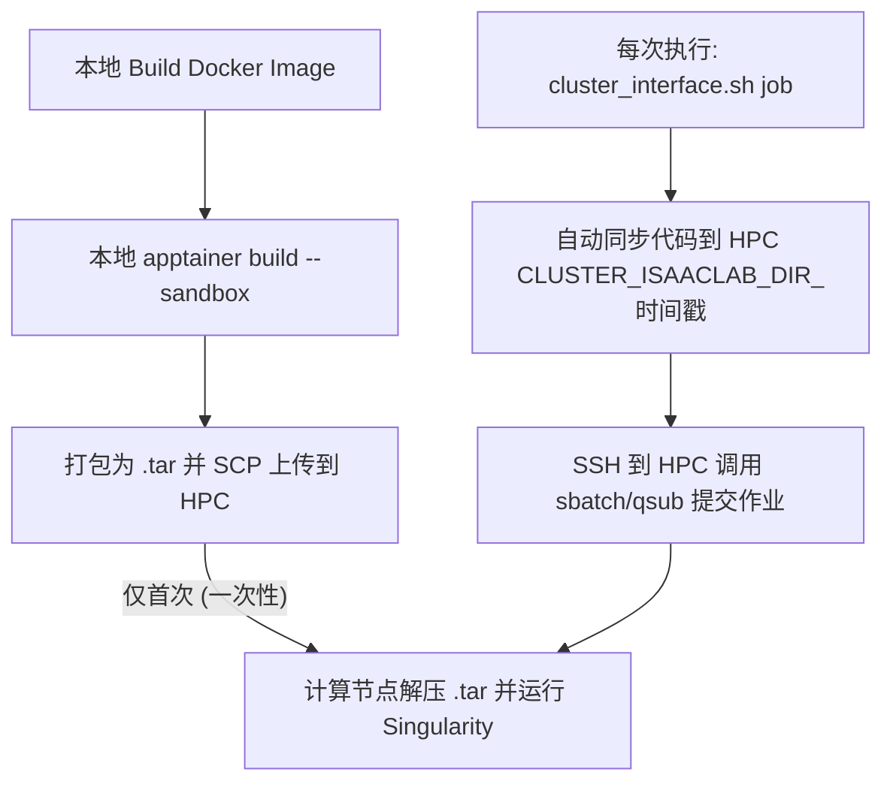

# Isaac Lab 官方集群方案 (Official Cluster Interface)

> 基于 Isaac Lab 官方 `cluster_interface.sh` 脚本和工作流。
> - 官方 Cluster 指南：<https://isaac-sim.github.io/IsaacLab/main/source/deployment/cluster.html>
> - 官方 Docker 指南：<https://isaac-sim.github.io/IsaacLab/main/source/deployment/docker.html>
> - 官方实现：`/home/hz/IsaacLab/docker/cluster/`

由于 HPC 集群不允许直接运行 `docker run`，官方方案的核心逻辑是：**本地打包 → 自动同步代码 → 自动提交 SLURM/PBS 作业**。



---

## 0. 官方 Docker 基础设施概览

> 本节内容整合自官方 Docker 指南和 `/home/hz/IsaacLab/docker/` 目录。

### 0.1 官方 `docker/` 目录组织结构

Isaac Lab 仓库根目录下的 `docker/` 目录包含运行 Isaac Lab Docker 容器所需的所有文件：

| 文件 | 用途 |
| :--- | :--- |
| `Dockerfile.base` | 定义基础 Isaac Lab 镜像，在 Isaac Sim 基础镜像之上叠加 Isaac Lab 依赖 |
| `docker-compose.yaml` | 创建挂载卷和绑定挂载，管理容器运行配置 |
| `.env.base` | 存储基础构建和容器运行所需的环境变量（镜像名、版本、路径等） |
| `container.py` | 核心工具脚本，对 `docker compose` 命令做高层封装 |
| `Dockerfile.ros2` | 镜像扩展：在 base 镜像之上添加 ROS2 Humble |
| `.env.ros2` | ROS2 扩展的环境变量 |
| `Dockerfile.curobo` | 镜像扩展：在 base 镜像之上添加 cuRobo |
| `docker-compose.cloudxr-runtime.patch.yaml` | CloudXR Runtime 支持补丁 |
| `.env.cloudxr-runtime` | CloudXR Runtime 环境变量 |
| `container.sh` | 简化版 bash 入口（备选 `container.py`） |
| `x11.yaml` | X11 转发 compose 配置片段 |
| `utils/` | `container.py` 的 Python 工具模块 |
| `cluster/` | 集群部署子目录（见下文 §1） |

### 0.2 官方 `container.py` 命令一览

`container.py` 是官方提供的 Docker 管理入口（`profile` 默认为 `base`，可选 `base`/`ros2`）：

| 命令 | 作用 |
| :--- | :--- |
| `./docker/container.py build [profile]` | 构建镜像，不启动容器 |
| `./docker/container.py start [profile]` | 构建镜像并在后台启动容器（detached mode） |
| `./docker/container.py enter [profile]` | 在已运行的容器中启动新的 bash 进程 |
| `./docker/container.py config [profile]` | 输出合并后的 compose.yaml 配置（调试用） |
| `./docker/container.py copy [profile]` | 从容器卷拷贝日志、数据和文档到 `docker/artifacts/` |
| `./docker/container.py stop [profile]` | 停止并删除容器 |

```bash
# 官方典型用法
./docker/container.py start        # 默认 base profile，后台启动
./docker/container.py enter base   # 进入已有容器
./docker/container.py stop         # 停止容器
```

### 0.3 Docker 挂载卷参考表

官方 `docker-compose.yaml` 创建了以下 **named volumes**（Docker volume），用于在容器重启间持久化数据：

| 卷名 | 用途 | 容器内路径 |
| :--- | :--- | :--- |
| `isaac-cache-kit` | Kit 缓存资源 | `/isaac-sim/kit/cache` |
| `isaac-cache-ov` | OV 缓存资源 | `/root/.cache/ov` |
| `isaac-cache-pip` | pip 缓存 | `/root/.cache/pip` |
| `isaac-cache-gl` | GLCache | `/root/.cache/nvidia/GLCache` |
| `isaac-cache-compute` | ComputeCache | `/root/.nv/ComputeCache` |
| `isaac-logs` | Omniverse 日志 | `/root/.nvidia-omniverse/logs` |
| `isaac-carb-logs` | carb 日志 | `/isaac-sim/kit/logs/Kit/Isaac-Sim` |
| `isaac-data` | OV 数据 | `/root/.local/share/ov/data` |
| `isaac-docs` | 文档 | `/root/Documents` |
| `isaac-lab-docs` | Isaac Lab 文档构建产物 | `/workspace/isaaclab/docs/_build` |
| `isaac-lab-logs` | Isaac Lab 运行日志 | `/workspace/isaaclab/logs` |
| `isaac-lab-data` | 用户数据持久存储 | `/workspace/isaaclab/data_storage` |

此外，以下目录以 **bind mount** 方式挂载，允许在宿主机编辑代码后容器内即时生效：

| 宿主机路径 | 容器内路径 |
| :--- | :--- |
| `IsaacLab/source` | `/workspace/isaaclab/source` |
| `IsaacLab/scripts` | `/workspace/isaaclab/scripts` |
| `IsaacLab/docs` | `/workspace/isaaclab/docs` |
| `IsaacLab/tools` | `/workspace/isaaclab/tools` |

> **与 HPC 环境的对应**：上述 volume 在 Singularity 环境下无法直接使用 Docker named volumes，官方 Cluster 方案改用 **bind mount 到 `$TMPDIR` 下的物理目录** 来模拟。详见 §5.1。

### 0.4 镜像扩展机制

官方支持通过 `profile` 参数选择镜像扩展：
- `base`（默认）：基础 Isaac Lab 镜像
- `ros2`：在 base 之上添加 ROS2 Humble

镜像和容器命名规则：`isaac-lab-${profile}`，可通过 `container.py` 的 `--suffix` 参数添加自定义后缀。

### 0.5 X11 转发与 Python 解释器

- **X11 转发**：首次 `start` 时询问是否启用，存储于 `docker/.container.cfg`。可通过 `X11_FORWARDING_ENABLED` 为 `0`/`1` 控制。
- **Python 解释器**：容器内使用 Isaac Sim 自带的 Python，位于 `/isaac-sim/python.sh`。`.bashrc` 中 alias 使得直接输入 `python` 即可调用。

---

## 1. 前提条件

> Source：<https://isaac-sim.github.io/IsaacLab/main/source/deployment/cluster.html#setup-instructions>

- 本地已安装 **Docker**（官方测试版本：24.0.7 / 27.3.1）和 **Apptainer**（官方测试版本：1.2.5-1.el7 / 1.3.4）
- 本地与 HPC 集群之间已配置 SSH 免密连接
- 已在本地通过 `./docker/container.py build` 构建好 `isaac-lab-base:latest` 镜像

安装 Apptainer（Ubuntu）：
```bash
sudo apt update
sudo apt install -y software-properties-common
sudo add-apt-repository -y ppa:apptainer/ppa
sudo apt update
sudo apt install -y apptainer
```

---

## 2. 集群参数配置 (`.env.cluster`)

> Source：<https://isaac-sim.github.io/IsaacLab/main/source/deployment/cluster.html#configuring-the-cluster-parameters>

修改本地 `/home/hz/IsaacLab/docker/cluster/.env.cluster`：

| 参数 | 描述 |
| :--- | :--- |
| `CLUSTER_JOB_SCHEDULER` | 作业调度器类型，支持 `SLURM` 或 `PBS` |
| `CLUSTER_ISAAC_SIM_CACHE_DIR` | HPC 上的 Isaac Sim 缓存目录，**路径必须以 `docker-isaac-sim` 结尾**。作业运行前会拷贝到计算节点 `$TMPDIR` |
| `CLUSTER_ISAACLAB_DIR` | HPC 上的 Isaac Lab 代码存放根目录，**路径必须以 `isaaclab` 结尾**。每次提交作业时会创建带时间戳的子目录 |
| `CLUSTER_LOGIN` | 集群 SSH 登录信息，格式 `用户名@集群地址` |
| `CLUSTER_SIF_PATH` | SIF 镜像在 HPC 上的存储路径 |
| `REMOVE_CODE_COPY_AFTER_JOB` | 作业完成后是否删除临时代码副本（`true`/`false`） |
| `CLUSTER_PYTHON_EXECUTABLE` | 在 Isaac Lab 内要执行的 Python 脚本路径，如 `scripts/reinforcement_learning/rsl_rl/train.py` |

配置示例：
```bash
# 调度器类型，支持 SLURM 或 PBS
CLUSTER_JOB_SCHEDULER=SLURM

# 缓存目录
CLUSTER_ISAAC_SIM_CACHE_DIR=/hpc2hdd/home/hwang721/docker-isaac-sim

# 远程 HPC 上的 IsaacLab 存放根目录（路径必须以 isaaclab 结尾）
CLUSTER_ISAACLAB_DIR=/hpc2hdd/home/hwang721/isaaclab

# 远程 HPC 登录节点 SSH 连结信息
CLUSTER_LOGIN=hwang721@hpc_ip

# SIF 镜像 .tar 文件在超算上的持久存储路径（push 时上传、job 时读取）
CLUSTER_SIF_PATH=/hpc2hdd/home/hwang721/isaaclab_docker/

# Python 入口脚本
CLUSTER_PYTHON_EXECUTABLE=scripts/reinforcement_learning/rsl_rl/train.py
```

---

## 3. 作业参数配置

> Source：<https://isaac-sim.github.io/IsaacLab/main/source/deployment/cluster.html#defining-the-job-parameters>

### SLURM (`docker/cluster/submit_job_slurm.sh`)

```bash
#SBATCH -n 1
#SBATCH --cpus-per-task=8
#SBATCH --gpus=rtx_3090:1
#SBATCH --time=23:00:00
#SBATCH --mem-per-cpu=4048
#SBATCH --mail-type=END
#SBATCH --mail-user=name@mail
#SBATCH --job-name="training-$(date +"%Y-%m-%dT%H:%M")"
```

> 关键要求：计算节点需要互联网访问权限以从 Nucleus 服务器加载资产。

### PBS (`docker/cluster/submit_job_pbs.sh`)

```bash
#PBS -l select=1:ncpus=8:mpiprocs=1:ngpus=1
#PBS -l walltime=01:00:00
#PBS -j oe
#PBS -q gpu
#PBS -N isaaclab
#PBS -m bea -M "user@mail"
```

---

## 4. 常用操作命令

### 步骤 1：本地打包并推送镜像（首次/镜像更新时执行一次）

```bash
cd /home/hz/IsaacLab/docker
# 将本地 Docker 镜像转为 Singularity Sandbox 并打包上传至 CLUSTER_SIF_PATH
./cluster/cluster_interface.sh push base
```

此命令的执行流程（实现于 `cluster_interface.sh` push 分支）：
1. 检查 Docker 镜像 `isaac-lab-base:latest` 存在
2. `apptainer build --sandbox --fakeroot isaac-lab-base.sif docker-daemon://...`
   — 将 Docker 镜像转为 sandbox 目录。产物名为 `isaac-lab-base.sif` 但**实质是 sandbox 目录**，不是不可变的 .sif 单文件镜像
3. `tar` 打包 sandbox 目录
4. `scp` 上传到 HPC 的 `CLUSTER_SIF_PATH`

> 此步骤只需在首次提交作业或镜像更新时执行一次。

### 步骤 2：本地一键同步代码并提交作业

```bash
# 自动同步本地最新修改的 Isaac Lab 代码，并以 base 镜像在超算上提交训练任务
./cluster/cluster_interface.sh job base --headless --task Isaac-Velocity-Rough-Anymal-C-v0 --video --enable_cameras
```

> [!NOTE]
> 每次执行 `job` 命令时，脚本会在超算上创建一个带有当前时间戳的临时目录（如 `CLUSTER_ISAACLAB_DIR_20260601_1450`），将本地最新代码 `rsync` 过去。作业运行完毕后，临时代码副本会根据 `REMOVE_CODE_COPY_AFTER_JOB` 设置自动清理或保留。

### 计算节点实际执行流程 (`run_singularity.sh`)

> Source：`/home/hz/IsaacLab/docker/cluster/run_singularity.sh`

作业在计算节点上执行时，`run_singularity.sh` 负责：
1. 将持久缓存从 `CLUSTER_ISAAC_SIM_CACHE_DIR` 拷贝到 `$TMPDIR`
2. 将临时代码目录拷贝到 `$TMPDIR`
3. 在 `$TMPDIR` 中解压 `.tar` 得到 sandbox 目录
4. 以 `--nv --writable --containall` 启动 singularity，bind mount 所有缓存目录
5. 通过 `/isaac-sim/python.sh` 执行 `CLUSTER_PYTHON_EXECUTABLE` 脚本
6. 执行完毕后，`rsync` 增量缓存回 `CLUSTER_ISAAC_SIM_CACHE_DIR`

---

## 5. 超算运行注意事项

### 5.1 缓存热启动 (Cache Persistence)

首次启动 Isaac Sim 会触发庞大的 **Shader 编译** 流程，导致首次加载极其缓慢。

官方 Docker 环境中有 12 个 named volumes，在 HPC Singularity 环境下，大部分（8 个缓存/数据/日志目录 + 1 个 Isaac Lab 日志目录）改为 `$TMPDIR` 下的物理目录 bind mount，另有 3 个 volume（`isaac-carb-logs`、`isaac-lab-docs`、`isaac-lab-data`）在官方 `run_singularity.sh` 中未显式映射。缓存同步流程：
1. **开始前**：将持久存储中的缓存目录拷贝到计算节点本地高速 `$TMPDIR`
2. **运行中**：Singularity 通过 `--bind` 将 `$TMPDIR` 下的缓存目录映射到容器内对应路径
3. **结束后**：`rsync -azP` 将增量缓存回写到持久存储

对应关系：

| 持久缓存子目录 | 容器内 bind mount 路径 | 对应官方 volume |
| :--- | :--- | :--- |
| `cache/kit` | `/isaac-sim/kit/cache` | `isaac-cache-kit` |
| `cache/ov` | `/root/.cache/ov` | `isaac-cache-ov` |
| `cache/pip` | `/root/.cache/pip` | `isaac-cache-pip` |
| `cache/glcache` | `/root/.cache/nvidia/GLCache` | `isaac-cache-gl` |
| `cache/computecache` | `/root/.nv/ComputeCache` | `isaac-cache-compute` |
| `logs` | `/root/.nvidia-omniverse/logs` | `isaac-logs` |
| `data` | `/root/.local/share/ov/data` | `isaac-data` |
| `documents` | `/root/Documents` | `isaac-docs` |

### 5.2 Headless 运行

由于超算节点没有物理显示器，运行仿真脚本时：
* 必须在 Python 启动命令中添加 `--headless` 参数。
* 确保代码实例化 `AppLauncher` 时 `headless` 参数设为 `True`，否则会触发 `Failed to initialize GLFW` 错误。

> 官方要求：计算节点必须能访问互联网以从 Nucleus 服务器加载仿真资产。

---

## 方案特点总结

| 特性 | 官方方案 |
| :--- | :--- |
| **容器格式** | Singularity Sandbox 打包成 `.tar`（在节点临时解压运行） |
| **代码同步** | **自动同步** — 每次提交作业 `rsync` 到临时目录 |
| **Python 依赖** | **预装模式**：所有依赖需在 `docker build` 阶段装好；运行时 `pip install` 虽可写但因 sandbox 在 `$TMPDIR`，作业结束后丢失 |
| **用户权限** | **要求严格** — 本地 UID/GID 必须与 HPC 完全一致 |
| **适用场景** | 代码结构相对固定、无需频繁修改依赖的纯训练/测试阶段 |
